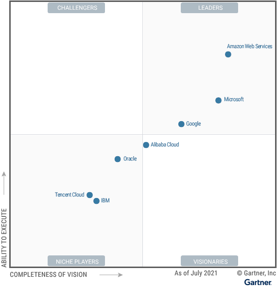
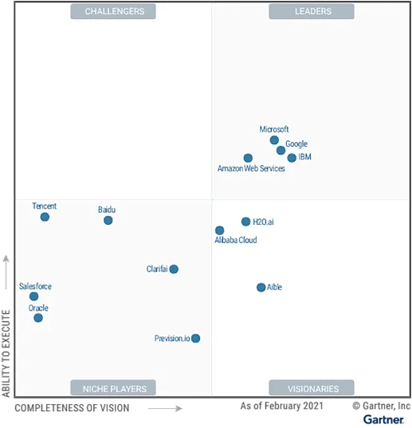
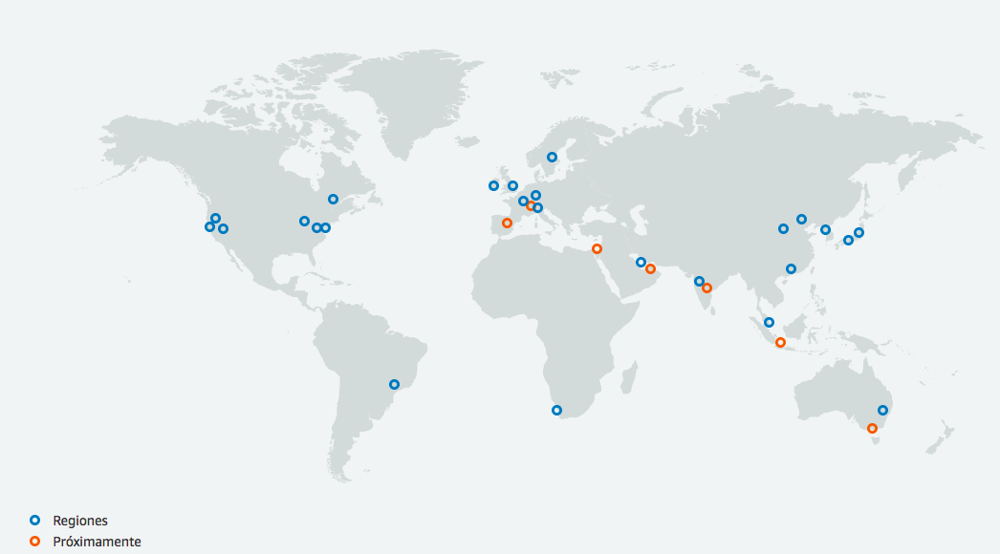
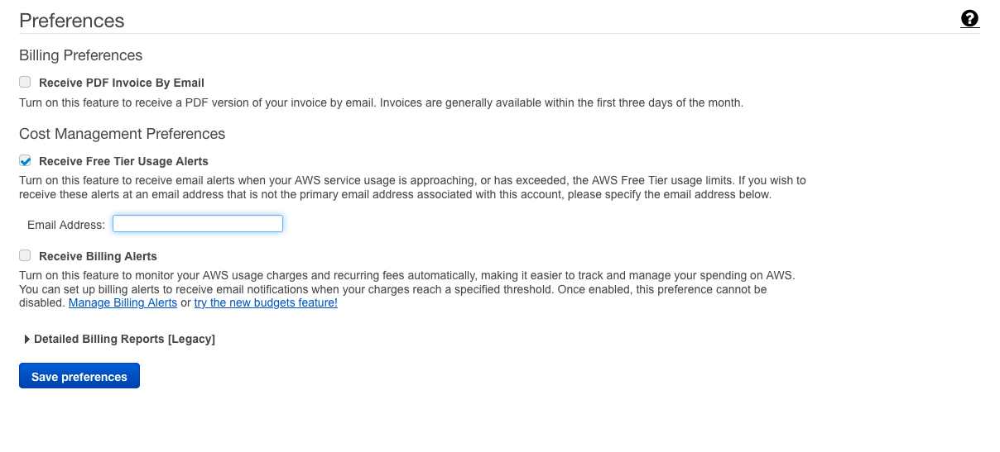
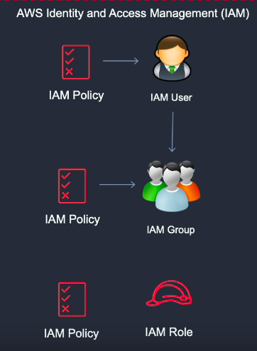
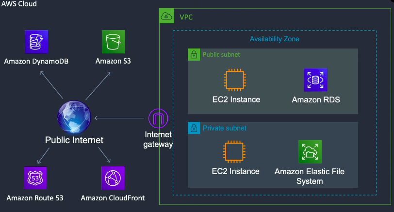
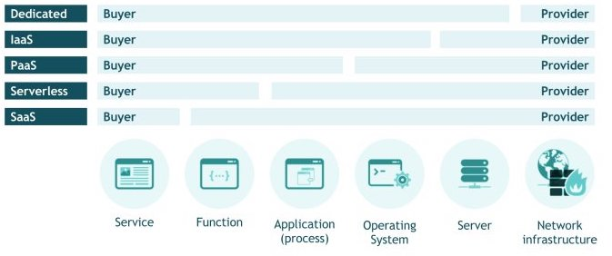
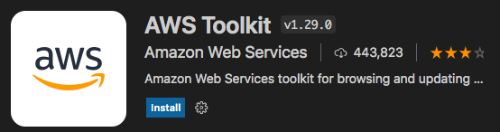

<style>
img[alt~="center"] {
  display: block;
  margin: 0 auto;
}
</style>

# Introducción a AWS

---
# Overview 

- Lanzada internamente en 2002.
- Lanzada publicamente en 2004.
- Relanzado con S3 y EC2 en 2006.
- Todo amazon.com migrado a AWS en 2010.
- Beneficio de 45$ Billones en 2020.
- Más de 200 servicios.
---


---




- 48% del segmento del mercado en IaaS.
- Líder durante más de 10 años.

---

IA Developer services:




---


# Documentación

https://docs.aws.amazon.com/index.html

---

# AWS Global Infrastructure

- Amazon EC2 está hospedado en varias ubicaciones de todo el mundo.

- 24 Regiones:




---

- Estas ubicaciones se componen de regiones, zonas de disponibilidad, Local Zones, AWS Outposts y zonas de Wavelength. Cada región es un área geográfica independiente.
- Cada región de Amazon EC2 se ha diseñado para que esté totalmente aislada de las demás regiones de Amazon EC2. Con ello se consigue la mejor tolerancia a errores y estabilidad posibles. 
- Las zonas de disponibilidad son varias ubicaciones aisladas dentro de cada región.
- Cuando lanza una instancia o servicio, puede seleccionar una zona de disponibilidad o dejar que se eliga automaticamete.
- Las regiones entre sí están conectadas con una red de muy alto anche de banda y rebundante.
- https://aws.amazon.com/es/about-aws/global-infrastructure/

---

- Cuando se consultan los recursos, solo se ven los recursos vinculados a la región especificada. 
- Esto se debe a que las regiones están aisladas entre sí y no replicamos automáticamente los recursos en distintas regiones. 

---
# Costes

- Los costes fundamentales son:
  - Compute: CPU y RAM
  - Storage: gastado o alocado.
  - Outbound Data Transfer: Trasnferencia hacia afuera.

- https://aws.amazon.com/es/pricing/
- https://calculator.aws
---

# Nivel Gratuito

- Más de 100 productos gratuitos.
- https://aws.amazon.com/es/free/?all-free-tier.sort-by=item.additionalFields.SortRank&all-free-tier.sort-order=asc&awsf.Free%20Tier%20Types=*all&awsf.Free%20Tier%20Categories=*all


---

# Billing Alarm 

- Usaremos mayoritariamente recursos de la capa free tier.
- Billing -> Billing Preferences --> FreeTier
- Cloudwatch: Permite crear alarmas sobre métricas por ejemplo facturación.

---



---

# DEMO

---
# AWS Identity and Access Management (IAM)

- Con AWS Identity and Access Management (IAM) jestionamos los usuarios y las políticas de acceso en AWS.
- La cuenta que acabas de crear es la Root Account: AWS recomienda no usarla.
- Debes crear cuenta para ti y otros usuarios.

---




---

- IAM User: Representa una persona o service
- IAM Group: Collecion de usuarios
- IAM Role: Delegación (usado en servicios, lo vermos más adelante)
- Podemos aplicar Policies a Usuarios, grupos o roles donde se especifican los permisos


---

# Métodos de Autentificación


- Access Key: Compuesta de access key ID y secret access key. Usadas por ejemplo para AWS CLI o para hacer a AWS en tus programas.
- Password: para acceder para la AWS Management Console.


---

# DEMO

---

# Ejercicio
- Creamos una cuenta en AWS.
- Añadimos las alarmas de freetier y de coste.
- Creamos un grupo y un usuario con policy: AdministratorAccess.
- Obtenemos el csv con: User name,Password, Access key ID, Secret access key, Console login link
- Nos logeamos en la consola de AWS con este nuevo usuario. 
---

# Amazon Virtual Private Cloud (VPC)

- Espacio virtual donde puedes lanzar recursos.
- Porción aislada en una región de aws.

---


---

- Podemos tener subnets en diferentes zonas de disponibilidad.
- Public subnets: tienen dirección IP pública. 

---

# DEMO


---

# Servicios públicos y privados



---
# IaaS, PaaS, SaaS



- https://aws.amazon.com/es/types-of-cloud-computing/

---


# AWS CLI

- https://aws.amazon.com/es/cli/
- Podemos configurar la utilidad con:
```bash
aws configure
```
Nos pedira:
```
AWS Access Key ID [None]:  
AWS Secret Access Key [None]: 
Default region name [None]: eu-west-3
Default output format [None]: text
```

---

# AWS Toolkit Visual Studio Code

- Extension vscode:



---

# Python Library: boto3

- Boto3 facilita la integración de su aplicación, biblioteca o script de Python con los servicios de AWS, incluidos Amazon S3, Amazon EC2, Amazon DynamoDB y más.
- https://boto3.amazonaws.com/v1/documentation/api/latest/guide/quickstart.html

---

# DEMO

---

# Ejercicio

- Instala la AWS CLI.
- Instala la extensión AWS en vscode.
- Configura ambas.
