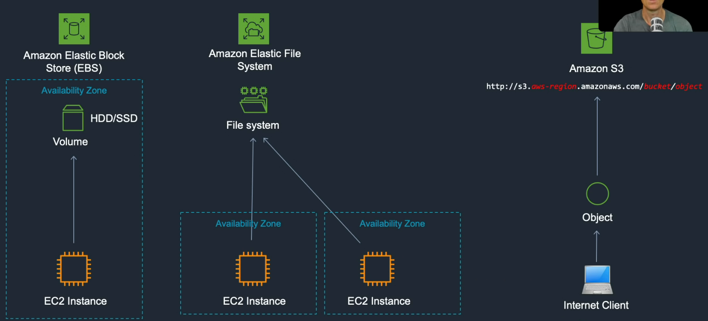
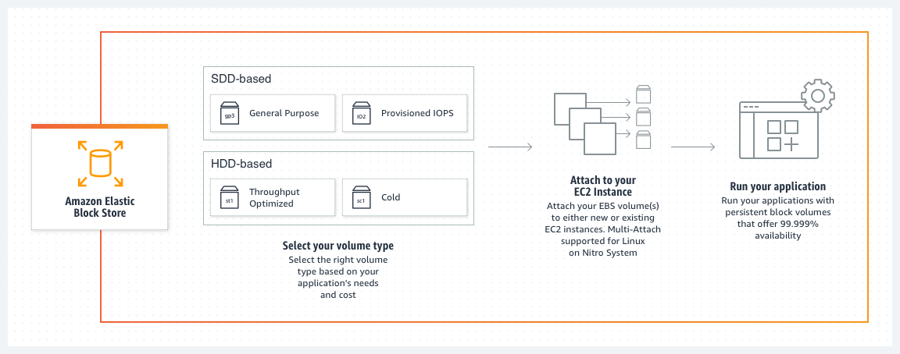
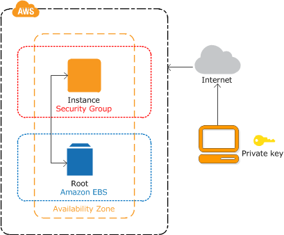
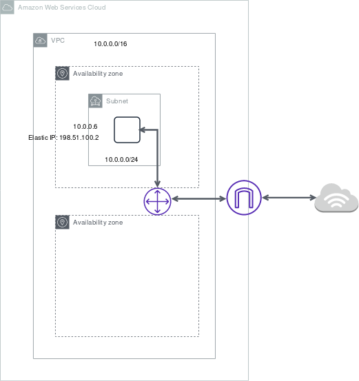
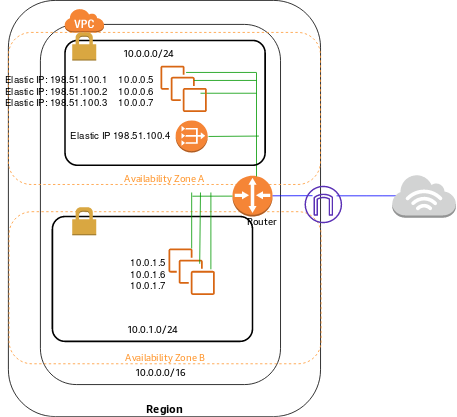
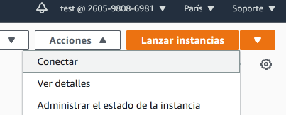
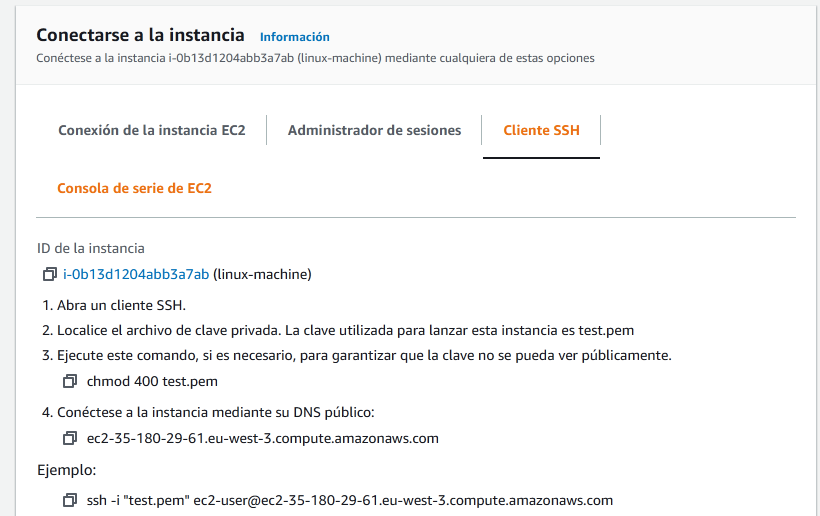

<style>
img[alt~="center"] {
  display: block;
  margin: 0 auto;
}
</style>

# Amazon Elastic Compute Cloud: EC2

---

- Amazon Elastic Compute Cloud (Amazon EC2) proporciona capacidad de computación escalable en la nube de Amazon Web Services (AWS).
- Uno de los servicios más antiguos en AWS.
- Nos permite deplegar máquinas virtuales en AWS.

---
# Características

- Entornos informáticos virtuales, conocidos como instancias
- Plantillas preconfiguradas para las instancias, conocidas como imágenes de máquina de Amazon (AMI), que empaquetan las partes que necesita para el servidor (incluido el sistema operativo y el software adicional)
- Varias configuraciones de CPU, memoria, almacenamiento y capacidad de red de las instancias, conocidos como tipos de instancias
- Información de inicio de sesión segura para las instancias con pares de claves (AWS almacena la clave pública y usted guarda la clave privada en un lugar seguro)

---
# Características

- Volúmenes de almacenamiento para datos temporales que se eliminan cuando una instancia se detiene, se termina o se pone en hibernación, lo que se conoce como volúmenes del almacén de instancias
- Volúmenes de almacenamiento persistente para los datos usando Amazon Elastic Block Store (Amazon EBS), conocidos como volúmenes de Amazon EBS
- Varias ubicaciones físicas para los recursos, como las instancias y los volúmenes de Amazon EBS, conocidas como regiones y zonas de disponibilidad

---
# Características
- Un firewall que permite especificar los protocolos, los puertos y los rangos de direcciones IP que pueden alcanzar las instancias mediante el uso de grupos de seguridad
- Direcciones IPv4 estáticas para informática en la nube dinámica, conocidas como direcciones IP elásticas
- Metadatos, conocidos como etiquetas, que se pueden crear y asignar a los recursos de Amazon EC2
- Redes virtuales que puede crear que están aisladas lógicamente del resto de la nube de AWS y que, opcionalmente, puede conectar a su propia red, conocidas como nubes virtuales privadas (VPC)

---

Amazon EC2 proporciona las siguientes opciones de compra de instancias:
- On-Demand Instances: por segundos.
- Savings Plans: cantidad de uso constante, en USD por hora, durante un período de 1 o 3 años.
- Reserved Instances: comprometiéndose con una configuración de instancia específica, incluido el tipo de instancia y la región, por un período de 1 o 3 años.
- Spot Instances: Solicite instancias EC2 no utilizadas. Muy interesante para entrenamiento de modelos de machine learning.

---

# Servicios de almacenamiento: Bloque, Fichero y Objeto.



---

# Almacenamiento
- Las instancias EC2 son instancias con respaldo Amazon Elastic Block Store (EBS).
- El volumen raíz es un volumen de EBS.

---

# Amazon Elastic Block Store (EBS)

- Amazon Elastic Block Store (EBS) es un servicio de almacenamiento en bloque fácil de usar, escalable y de alto rendimiento diseñado para Amazon Elastic Compute Cloud (EC2). 
- Tipos: https://aws.amazon.com/es/ebs/features/?pg=ln&cp=bn
- Podemos hacer snapshots de los EBS.

---



---

- Puede especificar la zona de disponibilidad en la que se ejecuta la instancia o dejar que Amazon EC2 seleccione una zona de disponibilidad. 
- Al lanzar la instancia, la protege especificando con un par de claves y un grupo de seguridad. 
- Al conectarse a la instancia, debe especificar la clave privada del par de claves que especificó cuando lanzó la instancia. 

---



---

## Crear un par de claves

- AWS utiliza criptografía de clave pública para proteger la información de inicio de sesión de la instancia.
- Una instancia de Linux no tiene contraseñas; en su lugar, se utiliza un par de claves para iniciar sesión en su instancia de manera segura. 
- Se especifica el nombre del par de claves cuando lanza la instancia, luego proporciona la clave privada cuando inicia sesión con SSH. Mediante el comando ssh o con vscode.
- Se puede crear antes de crear la instacia o cuando creamos la instacia.
- Podemos usar la misma clave privada para varas instacia.

---

- Abra la consola de Amazon EC2 en https://console.aws.amazon.com/ec2/
- En el panel de navegación, seleccione Key Pairs (Pares de claves).
- Elija Create key pair (Crear par de claves).
- En Name (Nombre), escriba un nombre descriptivo para el par de claves.
- En File format (Formato de archivo), elija el formato en el que desea guardar la clave privada. 
- Para Linux: guardar la clave privada en un formato que se pueda utilizar con OpenSSH, elija pem. 
- Para Windows: la clave privada en un formato que se puede utilizar con PuTTY, elija ppk.
- Elija Create key pair (Crear par de claves).

---

# DEMO
---
 
# Grupo de seguridad

- Los grupos de seguridad actúan como firewall para las instancias asociadas al controlar el tráfico entrante y saliente en el ámbito de la instancia. 
- Debe agregar reglas a un grupo de seguridad que le permita conectarse a la instancia desde su dirección IP mediante SSH. 
- También se pueden añadir reglas que permitan HTTP de entrada y salida y acceso HTTPS desde cualquier lugar.
- Se puede crear antes de crear la instacia o cuando creamos la instacia.


---

# DEMO

---

# Lanzando una instacia

- Para lanzar una instancia Linux mediante la AWS Management Console:
  - Abra la consola de Amazon EC2 en https://console.aws.amazon.com/ec2/
  - En el panel de la consola, elija Launch Instance.
  - Elegir una Amazon Machine Image (AMI): Seleccione una versión HVM de Amazon Linux 2. ("Free tier eligible", Apta para la capa gratuita).
  - En la página Choose an Instance Type (Elegir un tipo de instancia), puede seleccionar la configuración de hardware de la instancia. Seleccione el tipo de instancia t2.micro, que es la opción predeterminada.

---

- En la página Choose an Instance Type (Elegir un tipo de instancia). El resto de pasos podemos dejar que que el asistente complete las demás opciones de configuración.

- En Security Groups (Grupos de seguridad), verá que el asistente ha creado y seleccionado un grupo de seguridad.
- Puede usar este grupo de seguridad o, como opción, puede seleccionar el grupo de seguridad ya creado.
- Elija Review and Launch (Revisar y lanzar).
- En la página Review Instance Launch, elija Launch.

---

- Cuando se le solicite un par de claves, seleccione Choose an existing key pair (Elegir un par de claves existente) y, a continuación, seleccione el par de claves que creó durante la configuración inicial. 
- Elija Launch Instances.
- Verá una página de confirmación que indicará que la instancia se está lanzando. Elija View Instances para cerrar la página de confirmación y volver a la consola.

---

# DEMO

---

- Puede ver el estado del lanzamiento en la pantalla Instances (Instancias). 
- La instancia tarda poco tiempo en lanzarse. 
- Al lanzar una instancia, su estado inicial es pending. 
- Una vez iniciada la instancia, el estado cambia a running y recibe un nombre de DNS público. (Si la columna del DNS IPv4 público está oculta, elija el icono de configuración (en la esquina superior derecha, active DNS IPv4 público , y elija Confirmar ).

---

# Conexión a la instancia

- Existen varias maneras de conectarse a su instancia Linux.
- Por ahora nos conectamos usando el propio navegador, posteriormente veremos como conectarnos por SSH y usando vscode.

---

# DEMO

---

# Para terminar la instancia

- En el panel de navegación, elija Instances (Instancias). En la lista de instancias, seleccione la instancia.
- Elija Instance state (Estado de la instancia) y Terminate instance (Terminar instancia).
- Cuando se le indique que confirme, elija Terminate (Terminar).
- Amazon EC2 apaga y termina la instancia. 
- Una vez terminada la instancia, permanecerá visible en la consola durante un breve periodo y, a continuación, se elimina automáticamente la entrada.
- No puede quitar la instancia terminada de la pantalla de la consola por sí mismo.

---

# DEMO
---
# Tipos de Instancias

- El tipo de instancia que especifique determinará el hardware del equipo host utilizado para la instancia. Cada tipo de instancia ofrece distintas características de computación, memoria y almacenamiento,
- https://aws.amazon.com/es/ec2/instance-types/
- https://calculator.aws/#/createCalculator/EC2?nc2=h_ql_pr_calc


---

# Instancias con GPU
- Existen tipos de instancia especificos con GPU:
  - P4: Hasta 8 NVIDIA A100 Tensor Core GPUs
  - P5: Hasta 8 GPU V100 de NVIDIA Tesla,
  - P2: GPU NVIDIA K80 
  - G4dn:GPU NVIDIA T4 
- Es necesario pedir a AWS para que aumente los límites de instancias en estos tipos.

---

# DEMO
---
# Amazon Machine Image (AMI)

- Amazon Machine Image (AMI) proporciona la información necesaria para lanzar una instancia. 
- Debe especificar una AMI al lanzar una instancia. 
- Cuando necesite varias instancias con la misma configuración, puede lanzarlas desde una misma AMI. 
- Puedes crear tus propias AMIs para que al lanzar la instacia no tenga que volver a instalar.

---
# DEMO

---

#  AWS Deep Learning AMI. 

- AMIs preconfigurada con NVIDIA CUDA y CUDNIA CUDNN.
- Instaladas con la mayoría de las librerias de deep learning: Tensorflow, pytorch etc.
- Existen otras soluciones para realizar entrenamientos de los modelos como es Sagemaker.
- https://aws.amazon.com/es/machine-learning/amis/
---

# Public IP
- Se pierde cuando se apaga la instancia.
- Usada en subnets públicas
- Sin coste.
- No se puede mover entre instancias. 

---

# Private IP
- Se mantiene cuando la instancia se para.
- Usada en subnets públicas y privadas.

---

# Elastic IP
- Una dirección IP elástica es una dirección IPv4 pública, a la que se puede tener acceso desde Internet
- Se asigna una dirección IP elástica a su cuenta de AWS, que es suya hasta que la libere. 
- Para garantizar un uso eficiente de las direcciones IP elásticas, tiene un pequeño cargo por hora si una dirección IP elástica no está asociada a una instancia en ejecución, o bien cuando está asociada a una instancia detenida o a una interfaz de red no conectada.
- Mientras su instancia esté en ejecución, no se le cobrará por una dirección IP elástica asociada a ella, 

---



---




---

# DEMO
---


# Ejercicio

- Crea una instancia EC2 en tu cuenta AWS: t2.micro,  Amazon Linux 2 en eu-west-3.
- Guarda el fichero .pem (lo usaremos despues).
- Conectate mediante la consola de aws a la instacia.

---

## Conexion SSH.
- Podemos conectarnos con otra máquina mediante el protocolo SSH.
- Para conectarnos a la máquina EC2 hacemos lo siguiente:

```bash
ssh -i "test.pem" ec2-user@DIR
```
Donde:
- "test.pem" es el fichero de clave que se descargo al crear la máquina.
-  ec2-user@DIR es la dirección de la máquina.

La conexión se puede cerrar con ```ctrl + x``` o el comando ```exit```

---

- Este comando lo puedes encontrar en la consola de aws:


---


---


- Si va a usar un cliente SSH en un equipo macOS o Linux para conectarse a su instancia de Linux, utilice el comando que se indica a continuación para establecer los permisos de su archivo de clave privada de manera que solo usted pueda leerlo. 
```bash
chmod 400 my-key-pair.pem
```

Más info en:
https://stackabuse.com/how-to-fix-warning-unprotected-private-key-file-on-mac-and-linux/

---

Si Aparece el error: WARNING: UNPROTECTED PRIVATE KEY FILE! 
Para solventarlo hacer:
```bash
sudo chmod 600 my-key-pair.pem
```
---

## Trasferencia de archivos con SCP.
- Podemos transferir ficheros de nuestra máquina a la máquina EC2 con el comando SCP:
```bash
scp -i test.pem ./source/test.txt ec2-user@DIR:~/destination/
```

- También de la máquina EC2 a nuestra máquina:
```bash
scp -i test.pem ec2-user@DIR:~/source/of/remote/test.txt ./where/to/put
```

---

# Ejercicio

- Conectate a la máquina EC2 mediante SSH.
- Instala la utilidad htop
- Ejecuta el comando htop

---

# Ejercicio
- Transfiere el fichero market_data.txt de tu ordenador a la máquina de EC2.
- Modificalo en la máquina de EC2 y traelo de vuelta.
Nota: usa el comando scp.
