<style>
img[alt~="center"] {
  display: block;
  margin: 0 auto;
}
</style>


# Desarrollo en remoto con vscode y SSH

--- 

- Como habéis visto desarrollar desde la terminal puede ser tedioso.
- vscode tiene una extensión llamada Remote - SSH que nos permite trabajar con nuestro vscode dentro de la máquina EC2.


---


- https://code.visualstudio.com/docs/remote/ssh

---
Los pasos para conectar nuestro Code a la máquina EC2 son los siguientes:

---

- Creamos una nueva instancia de EC2.
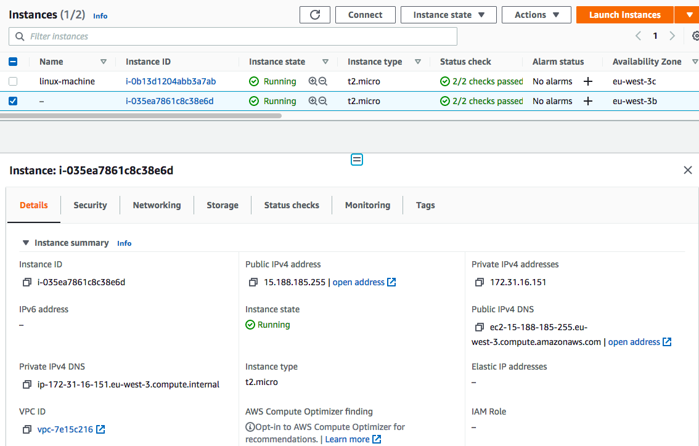

---

- Es importante que tegamos habilitado el pueto 22 (SSH) desde nuesta ip.
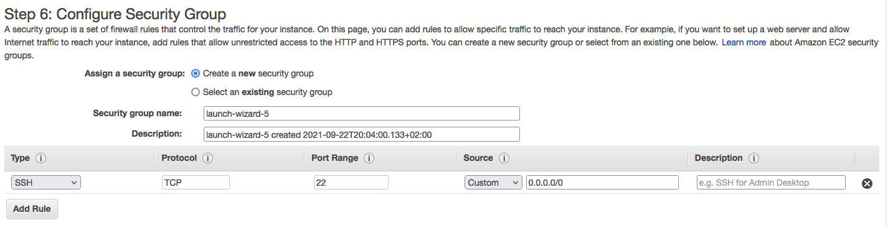

---

- En el último paso de la creación es necesario guardar el fichero con la clave privada.
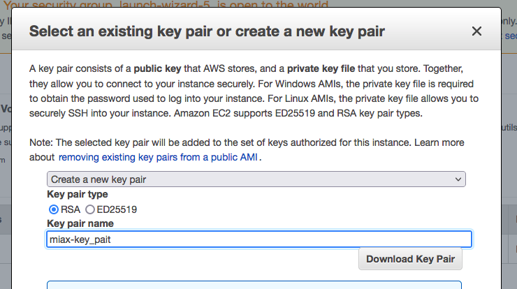

---

- Descargamos la extensión Remote - SSH.
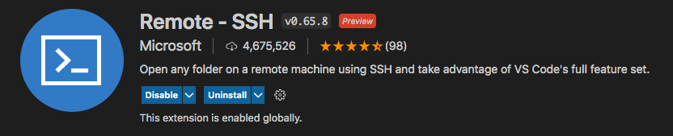
---

- Pulsamos el botón verde de la la esquina inferior izquierda.
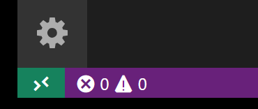
---

- Pulsamos: Remote - SSH: Connect to Host
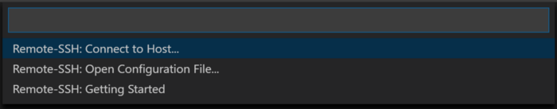
---

- Pulsamos Configure SSH
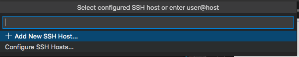


---
- Pulsa el primero de los ficheros perteneciente a tu usuario.
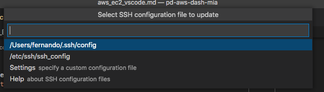
- Se abrira un fichero
---

Introduce lo siguinte:

```
Host aws-ec2
    HostName ec2-15-188-185-255.eu-west-3.compute.amazonaws.com
    User ec2-user
    IdentityFile /Users/fernando/git/pd-aws-dash-mia/auth/miax-key_pait.pem
```
Donde:
- Host (aws-ec2) es el nombre que queremos darle a la máquina, puede ser cualquiera.
- HostName es el host o IP del servidor.
- User es el nombre de usuario de la máquina EC2.
- IdentityFile es el path a la clave privada.

---

- Para obtener el HostName y User de tu instacia, entrar en la consola de EC2, seleccionar la instancia y pulsar conectar.

---

- Verás un diálogo como:

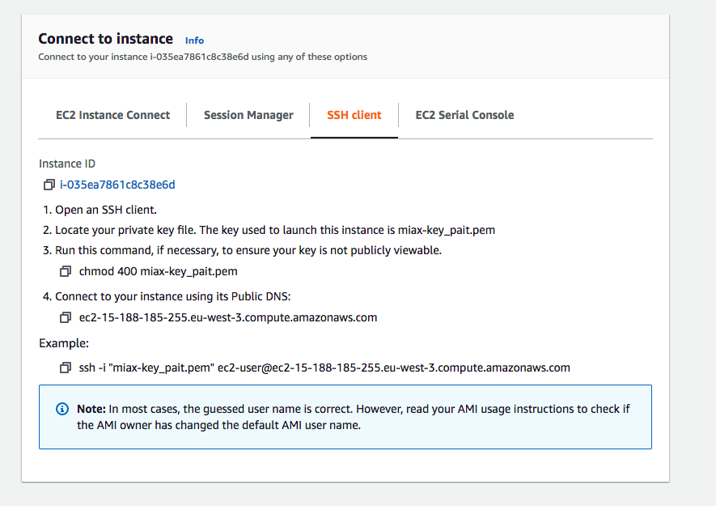

---
Una vez confgurado, puedes pulsar otra vez el boton verde, elegir Connect to host, y tenderá que aparecer la instancia EC2.
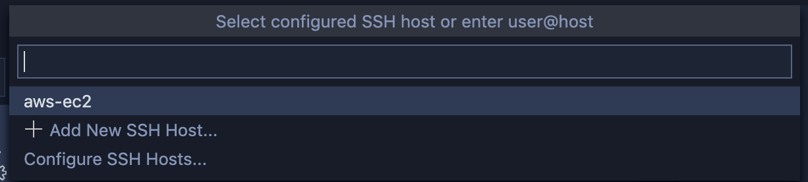

---

Se abrirá una nueva ventana, donde estarás conectado en tu máquina EC2:

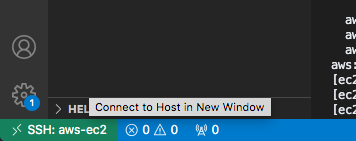


Una vez conectado puedes abrir una carpeta en concreto de la máquina EC2:
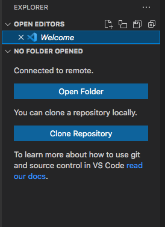

---

Puedes ver todas tus máquinas en el menú de Remote Explorer:
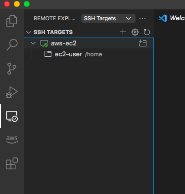

---

- Si va a usar un cliente SSH en un equipo macOS o Linux para conectarse a su instancia de Linux, utilice el comando que se indica a continuación para establecer los permisos de su archivo de clave privada de manera que solo usted pueda leerlo. 
```bash
chmod 400 my-key-pair.pem
```

Más info en:
https://stackabuse.com/how-to-fix-warning-unprotected-private-key-file-on-mac-and-linux/


