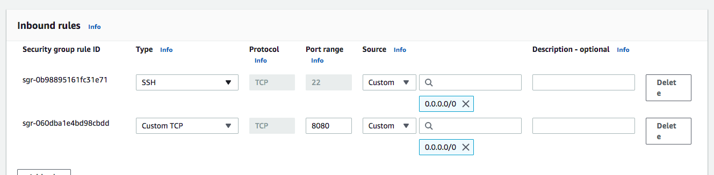

<style>
img[alt~="center"] {
  display: block;
  margin: 0 auto;
}
</style>


# Nuestra primera aplicación en AWS.

--- 

- Vamos a desplegar el API que realizamos en la clase de principios de desarrollo en AWS:

```python
from fastapi import FastAPI 
app = FastAPI() 

@app.get("/suma") 
def suma(a: int, b: int):
  return a+b 

```

---

- Para ello crearemos una máquina EC2 t2.micro. Es importante que en el proceso de creación abramos el puerto que queramos usar, para ello configúrala de el security group de la siguiente manera:



Así podremos usar el puerto 8080 para ejecutar nuestra API.

---
- Crea un nuevo repositorio de código en github.
- Clona el repositorio.
- Genera un nuevo virtual enviroment.
- Instala los paquetes necesarios (fastapi y uvicorn) y genera un fichero de requeriments.
- Escribe una API con FastApi que tengá un método GET en el path "/suma" que reciba dos parámetros de tipo int y los sume.

---
- Realiza un commit con todos los cambios y un push a github (CUIDADO venv!).
- Ejecuta la aplicación en nuestra máquina EC2. Para ello usa el siguiente comando:
```bash
uvicorn app:app --host 0.0.0.0 --port 8080
````
El fichero donde tienes el API se tiene que llamar app y dentro tienes que tener el objeto FastAPI como app.

- Consulta la IP pública de la máquina.
- Prueba desde un navegador si funciona con: ```http://IP_MAQUINA:8080/docs```.
- Comprueba que el método suma funciona con: ```http://IP_MAQUINA:8080/suma?a=1&b=2```.
- Puedes probar la de otro compañero para que veáis que no depende de vuestro ordenador.