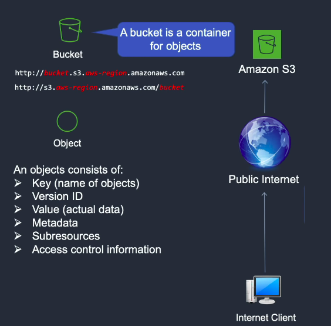

<style>
img[alt~="center"] {
  display: block;
  margin: 0 auto;
}
</style>

# Amazon Simple Storage Service: S3

---

- Amazon Simple Storage Service (Amazon S3) es un servicio de almacenamiento de objetos.
- Amazon S3 tiene una interfaz de servicios web simple que puede utilizar para almacenar y recuperar cualquier cantidad de datos.
- Diseñado para ofrecer una durabilidad del 99,999999999% y una disponibilidad de los objetos del 99,99% durante un año concreto. 
- Diseñado para aguantar una pérdida simultánea de datos en dos ubicaciones. 
---

- Podemos realizar las operaciones directamente desde la interfaz web, desde la CLI, desde la extensión de Visual Studio Code o desde python mediante boto3.
- Pandas nos permite leer ficheros de forma directa usando la URL del fichero.


---


---

Los buckets son los contenedores fundamentales en Amazon S3 para el almacenamiento de datos. 
- Cada objeto dentro del bucket puede contener hasta 5 TB de datos.
- Se pueden conceder o denegar acceso a otras personas que desean cargar o descargar datos en su bucket de Amazon S3.

---


# Buckets

- Un bucket es un contenedor para objetos almacenados en Amazon S3. 
- Cada objeto está almacenado en un bucket. 
- Por ejemplo, si el objeto denominado data/test.csv se almacena en el bucket awsexamplebucket1 en la región EE. UU. Oeste (Oregón), es direccionable mediante la URL https://awsexamplebucket1.s3.us-west-2.amazonaws.com/photos/puppy.jpg. 

---

# Objects

- Los objetos son las entidades fundamentales almacenadas en Amazon S3.
- Los objetos se componen de datos de objetos y metadatos. 
- La parte de datos es opaca para Amazon S3. 
- Los metadatos son conjuntos de pares nombre-​valor que describen el objeto. 
- Incluyen algunos metadatos predeterminados, como la fecha de la última modificación y los metadatos HTTP estándar, como Content-Type. También puede especificar metadatos personalizados en el momento en que se almacena el objeto. 

---

# Keys

- Una clave es el identificador único de un objeto dentro de un bucket. 
- Cada objeto de un bucket tiene exactamente una clave.
- La combinación de un bucket, clave e ID de versión identifican de forma única cada objeto.
- Por tanto, puede pensar en Amazon S3 como una asignación de datos básica entre "bucket + clave + versión" y el objeto en sí. 
- Se puede acceder a cada objeto de Amazon S3 de forma exclusiva a través de la combinación de punto de enlace de servicio web, nombre del bucket, clave, y de forma opcional, una versión. Por ejemplo, en la URL https://doc.s3.amazonaws.com/2006-03-01/AmazonS3.wsdl, "doc" es el nombre del bucket y "2006-03-01/AmazonS3.wsdl" es la clave. 

---

# Regions

- Puede elegir la región de AWS geográfica donde Amazon S3 almacenará los buckets. 
- Puede elegir una región para optimizar la latencia, minimizar los costos o cumplir con requisitos legales. 
- Los objetos almacenados en una región nunca la abandonan, a menos que se transfieran expresamente a otra región.


----





---

# Clases de almacenamiento

- Amazon S3 ofrece varios tipos de almacenamiento diseñados para distintos casos de uso. 
- Incluyen Amazon S3 STANDARD para almacenamiento general de los datos a los que se accede frecuentemente, Amazon S3 STANDARD_IA para datos de duración prolongada a los que se obtiene acceso con menos frecuencia y S3 Glacier para un archivado a largo plazo. 

- https://aws.amazon.com/es/s3/pricing/

---

# Operaciones en Buckets mediante la interfaz web

---

# DEMO

----

# Ejercicio

- Crea un bucket
- Sube un fichero
- Descarga el fichero que acabas de añadir

---

# Operaciones en Buckets mediante la interfaz de vscode

---

# DEMO

---

# Operaciones en  Buckets mediante CLI

- Crear un bucket:
```bash
 aws s3 mb <target> [--options]
 aws s3 mb s3://bucket-name
```

- Lista de buckets y objetos:
```bash
 aws s3 ls <target> [--options]

 aws s3 ls

 aws s3 ls s3://bucket-name
 aws s3 ls s3://bucket-name/example/
```
---
- Eliminar buckets:
```bash
 aws s3 rb <target> [--options]
 aws s3 rb s3://bucket-name
```
- Eliminar objetos
 ```bash
 aws s3 rm  <target> [--options]

 aws s3 rm s3://bucket-name/example/filename.txt --recursive
 aws s3 rm s3://bucket-name/example --recursive
```

---

- Mover objetos
```bash
 aws s3 mv <source> <target> [--options]
aws s3 mv s3://bucket-name/example s3://my-bucket/
```
- Mover objetos del host local al bucket
```bash
aws s3 mv filename.txt s3://bucket-name
```

---

- Mover objetos del bucket al host
```bash
aws s3 mv s3://bucket-name/filename.txt ./
```
- Copia de objetos
```bash
aws s3 cp <source> <target> [--options]

aws s3 cp s3://bucket-name/example s3://my-bucket/
aws s3 cp filename.txt s3://bucket-name
aws s3 cp s3://bucket-name/filename.txt ./
```

--- 

- Opción recursive: Al usar esta opción, el comando se ejecuta en todos los objetos o archivos del directorio especificado o con el prefijo especificado.
```bash
    aws s3 rm s3://my-bucket/path --recursive
```

- AWS CLI
https://docs.aws.amazon.com/cli/latest/userguide/cli-services-s3-commands.html


---

# Operaciones en python mediante boto3

- Python Boto3

```python
# Create a bucket
import boto3

s3_client = boto3.client('s3')
s3_client.create_bucket(Bucket=bucket_name)
```

---

```python
# upload file
import boto3

s3_client = boto3.client('s3')
response = s3_client.upload_file(file_name, bucket, object_name)
```

```python
# download file
import boto3
s3 = boto3.resource('s3')
s3.download_file('mybucket', 'hello.txt', '/tmp/hello.txt')
print(open('/tmp/hello.txt').read())
```

---

```python
# upload open file
s3 = boto3.client('s3')
with open("FILE_NAME", "rb") as f:
    s3.upload_fileobj(f, "BUCKET_NAME", "OBJECT_NAME")
```

- https://boto3.amazonaws.com/v1/documentation/api/latest/guide/s3-example-creating-buckets.html

---

Autentificación con python:


- Variables de entorno:
    - **AWS_ACCESS_KEY_ID:**: Access key.
    - **AWS_SECRET_ACCESS_KEY** The secret key.
- Directamente en python:
```python
import boto3
session = boto3.Session(
    aws_access_key_id=settings.AWS_SERVER_PUBLIC_KEY,
    aws_secret_access_key=settings.AWS_SERVER_SECRET_KEY,
)
s3 = session.resource('s3')
```

---

- El fichero ~/.aws/config file. 
- Usamos la AWS CLI para crearlo. Pandas o boto3 buscaran las credenciales en la carpeta ~/.aws. 
- Para ello:
    - pip install awscli
    - aws configure
    - Después de esto puedes usar boto3 o pandas sin hacer nada más.


---

# Operaciones en python mediante pandas

- Pandas usa la librería *s3fs* para acceder a s3.

```python
df = pd.read_csv(f"s3://{AWS_S3_BUCKET}/{key}")
```

```python
df.to_csv(f"s3://{AWS_S3_BUCKET}/{key}")
```


---

```python
df.to_csv(
    f"s3://{AWS_S3_BUCKET}/{key}",
    index=False,
    storage_options={
        "key": AWS_ACCESS_KEY_ID,
        "secret": AWS_SECRET_ACCESS_KEY,
        "token": AWS_SESSION_TOKEN,
    },
)
```

---

```python
df = pd.read_csv(
    f"s3://{AWS_S3_BUCKET}/{key}",
    storage_options={
        "key": AWS_ACCESS_KEY_ID,
        "secret": AWS_SECRET_ACCESS_KEY,
        "token": AWS_SESSION_TOKEN,
    },
)
```


---

# DEMO

---


- Amazon S3 se puede usar para alojar un sitio web estático.
- En un sitio web estático, cada página web incluye contenido estático.
- Cuando configura un bucket como sitio web estático, debe habilitar el alojamiento de sitios web estáticos, configurar un documento de índice y establecer permisos. 

- https://docs.aws.amazon.com/es_es/AmazonS3/latest/userguide/WebsiteHosting.html
---

# DEMO

---

# Ejercicio
Realiza mediante el portal de AWS, la extensión cd vscode y la CLI los siguientes pasos:
- Crea un bucket.
- Sube el fichero market_data.csv
- Descarga el fichero.

---

# Ejercicio
Desde la instacia EC2, realiza:
- Usando la librería boto3 lista los contenidos de uno de los buckets creados anteriormente.
- Sube el fichero market_data.csv usando boto3.

---

# Ejercicio
Desde la instacia EC2, realiza:
- Lee el fichero de market_data.csv. de uno de los buckets creados anteriormente, usando la librería pandas
- Modifica el contenido.
- Sube el nuevo fichero modificado como market_data_mod.csv.
