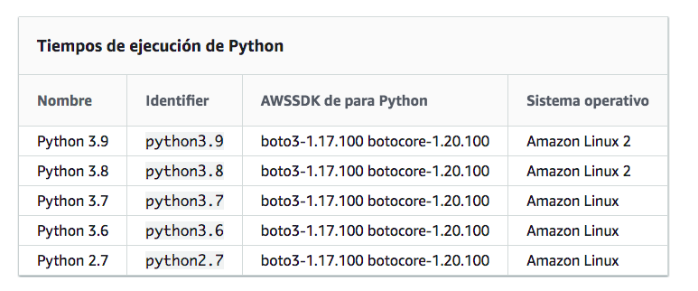
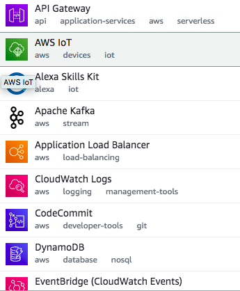
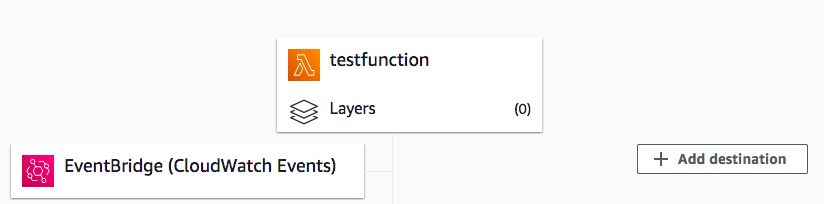
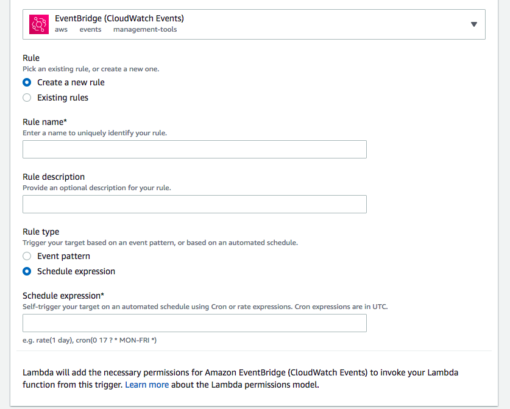
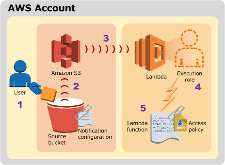
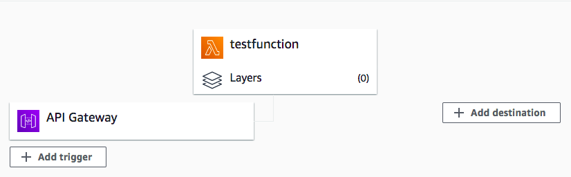
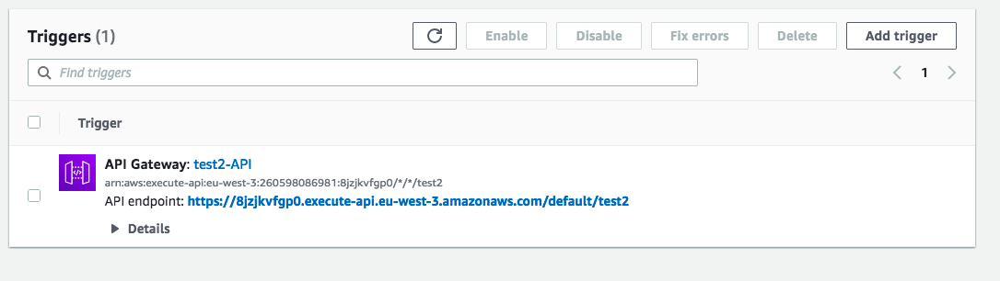

<style>
img[alt~="center"] {
  display: block;
  margin: 0 auto;
}
</style>

# Amazon Lambda

---


- Lambda es un servicio que permite ejecutar código sin aprovisionar ni administrar servidores.
- Lambda ejecuta el código en una infraestructura informática de alta disponibilidad y realiza todas las tareas de administración de los recursos informáticos, incluyendo:
    - El mantenimiento del servidor y del sistema operativo.
    - El aprovisionamiento de capacidad y el escalado automático.
    - Monitorización del código.
    - Funciones de logging. 
- Hasta 15 minutos de ejecución
- Muy barato.

---

Lenguajes admitidos:
- https://docs.aws.amazon.com/es_es/lambda/latest/dg/lambda-runtimes.html

---




---


- Ideal para muchos escenarios de aplicaciones, 
- Siempre que pueda ejecutar el código de la aplicación utilizando el entorno de tiempo de ejecución estándar de Lambda y dentro de los recursos que Lambda proporciona
- Solo es necesario preocuparse por el código. Lambda administra la flota de computación, que ofrece una combinación equilibrada de memoria, CPU, red y otros recursos para ejecutar su código. 


---


---


---


- Se pueden crear funciones en la consola de Lambda, CLI o la extension de vscode. 
- La consola de Lambda proporciona un editor de código para lenguajes no compilados que permiten modificar y probar el código con rapidez. 
- La AWS Command Line Interface (AWS CLI) ofrece acceso directo a la API de Lambda para la configuración avanzada y casos de uso de automatización. 


---

# Casos de uso
- Datos y análisis: Podemos cargar datos, por ejemplo en un csv, en un bucket de s3 y que cuando esto ocurra la función lamnda lo procese y lo envíe a otro bucket.
- Sitios web: Permite alojar la lógica del backend en Lambda. Puede invocar la función de Lambda a través de HTTP utilizando Amazon API Gateway como punto de enlace HTTP. A continuación, el cliente web puede invocar la API y, por último, API Gateway puede dirigir la solicitud a Lambda. 
- Procesos Periodicos: Podemos ejecutar un código frecuentemente, definiendo cuando con una expresión cron usando EventBridge.

---


# Function

Una función es un recurso que puede invocar para ejecutar el código en Lambda. Una función tiene código para procesar los eventos que pasa a la función o que otros AWS servicios envían a la función. 

---

# Trigger

Un desencadenador es un recurso o configuración que invoca una función de Lambda. Los desencadenadores incluyen los servicios de AWS que puede configurar para invocar una función 

---

# Event

- Un evento es un documento con formato JSON que contiene datos para que una función de Lambda los procese. 
- En tiempo de ejecución convierte el evento en un objeto y lo pasa al código de la función. 
- Cuando se invoca una función, se determina la estructura y el contenido del evento. 
- Para ver la estructura de los eventos de los distintos servicios de aws que pueden desencadenar la función lamnda: https://docs.aws.amazon.com/es_es/lambda/latest/dg/lambda-services.html

---

# Paquete de implementación

Lambda admite dos tipos de implementaciones:
- Un archivo de archivo .zip que contiene su código de función y sus dependencias.
- Imagen de contenedor compatible con la especificación Open Container Initiative (OCI). Lo veremos más adelante.

---

# Crear una función de Lambda con la consola.

- La función usa el código predeterminado que Lambda crea. 
- La consola de Lambda proporciona un editor de código para lenguajes no compilados 

---

- Abrir la Functions page (Página de funciones) en la consola de Lambda.
- Elija Create function (Crear función).
- Bajo Basic information (Información básica), haga lo siguiente:
    - En Function name (Nombre de función), introduzca my-function.
    - En Tiempo de ejecución, Elejir Python3.9
- Elija Create function (Crear función).

---
# Invocar la función de Lambda

- Después de seleccionar la función, elija la pestaña Prueba.
- En la sección evento de prueba, elija Nuevo evento. En Plantilla, deje la opción predeterminada hello-world. Introduzca un nombre para esta prueba y tenga en cuenta la siguiente plantilla de evento de ejemplo: 
- Elija Save changes (Guardar cambios) y después Test (Probar). Cada usuario puede crear hasta 10 eventos de prueba por función. Dichos eventos de prueba no están disponibles para otros usuarios.
- Lambda ejecuta la función en su nombre. El controlador de funciones recibe y procesa el evento de muestra. 

---

Si se realiza correctamente, puede ver los resultados en la consola.
- El resultado de ejecución muestra el estado de ejecución correctamente. Para ver los resultados de ejecución de la función, expanda detalles. Tenga en cuenta que el enlace de los logs (registros) abre la página de Log groups (Grupos de registro) en la consola de CloudWatch.
- La sección Summary (Resumen) muestra la información principal proporcionada en la sección Log output (Resultado del registro) (la línea REPORT del registro de ejecución).
- La sección de Log output (Salida de registro) muestra el registro que Lambda genera para cada invocación. La función escribe estos registros en CloudWatch. La consola de Lambda muestra estos registros para su comodidad. Elija Click here (Haga clic aquí) para agregar registros al grupo de registros de CloudWatch y abra la página Log groups (Grupos de registro) en la consola CloudWatch.

---


- Si ejecutamos la función (elija Test) unas cuantas veces más para recopilar algunas métricas que puede ver en el siguiente paso.
- Elija la pestaña Monitor (Monitorear). Esta página muestra gráficos de las métricas que Lambda envía a CloudWatch. 

---

# DEMO

---

# Ejercicio

- Cree una función lambda por defecto.
- Modifique el código en la consola de aws para que mueste la fecha en la que se ejecutó, y realice un print de event y context.
- Prueba la función con el test por defecto.
- Observe el resultado.

---


- Lambda administra la infraestructura que ejecuta el código, escalándola automáticamente en respuesta a las solicitudes entrantes. 
- Cuando la función se invoca a mayor velocidad de la que una sola instancia de su función puede procesar eventos, Lambda amplía la capacidad ejecutando instancias adicionales. 
- Cuando el tráfico disminuye, las instancias inactivas se bloquean o detienen. 
- Solo se paga por el tiempo que la función inicia o procesa eventos. 


---

- El código se ejecuta en un entorno que incluye el SDK for Python (Boto3), con credenciales de un rol de AWS Identity and Access Management (IAM) que se configuren. 


---


- El controlador de la función de Lambda es el método del código de la función que procesa eventos. 
- Cuando se invoca una función, Lambda ejecuta el método del controlador. 
- Si el controlador existe o devuelve una respuesta, pasará a estar disponible para gestionar otro evento. 


---

# Controlador de funciones en Python:

```python
def handler_name(event, context): 
    ...
    return some_value
```

---


- El nombre del controlador de funciones de Lambda especificado en el momento de la creación de una función de Lambda se deriva de:
    - El nombre del archivo en el que se encuentra la función del controlador de Lambda
    - El nombre de la función del controlador de Python

---


- Cuando Lambda invoca su controlador de función, el tiempo de ejecución de Lambda pasa dos argumentos al controlador de funciones:

- Evento. Un evento es un documento con formato JSON que contiene datos para que una función de Lambda los procese. Por lo general, es del tipo Python dict. El objeto de evento contiene información del servicio de invocación. 

- Contexto: Un objeto de contexto se pasa a su función de Lambda en tiempo de ejecución. Este objeto proporciona métodos y propiedades que facilitan información acerca de la invocación, la función y el entorno de tiempo de ejecución.

---


- Métodos de context
    - get_remaining_time_in_millis: devuelve el número de milisegundos que quedan antes del tiempo de espera de la ejecución.

---

- Propiedades de context
    - function_name: el nombre de la función de Lambda.
    - function_version: la versión de la función.
    - invoked_function_arn: el nombre de recurso de Amazon (ARN) que se utiliza para invocar esta función. Indica si el invocador especificó un número de versión o alias.
    - memory_limit_in_mb: cantidad de memoria asignada a la función.
    - aws_request_id: el identificador de la solicitud de invocación.
    - log_group_name: grupo de registros de para la función.
    - log_stream_name: el flujo de registro de la instancia de la función.

---

- En el siguiente ejemplo se muestra una función de controlador que registra información de context. 

```python
import time

def lambda_handler(event, context):   
    print("CloudWatch log stream name:", context.log_stream_name)
    print("CloudWatch log group name:",  context.log_group_name)
    print("Lambda Request ID:", context.aws_request_id)
    print("Lambda function memory limits in MB:", context.memory_limit_in_mb)
    # We have added a 1 second delay so you can see the time remaining in get_remaining_time_in_millis.
    time.sleep(1) 
    print("Lambda time remaining in MS:", context.get_remaining_time_in_millis())
```
---

# Devolver un valor

- El controlador puede devolver un valor. Lo que sucede con el valor devuelto depende del tipo de invocación y el servicio que invocó la función. Por ejemplo:
    - Si utiliza el tipo de invocación RequestResponse, como Invocación síncrona, AWS Lambda devuelve el resultado de la llamada a la función Python al cliente que invoca la función de Lambda.
    - Si el controlador devuelve objetos que no se pueden serializar con json.dumps, en tiempo de ejecución devuelve un error.
    - Si el controlador devuelve None, al igual que hacen las funciones de Python sin una instrucción return, el runtime devuelve null.

---

# Implementar funciones Python Lambda con archivos .zip

- El código de la función AWS Lambda se compone de scripts o programas compilados y sus dependencias. Lambda admite dos tipos de paquetes de implementación: imágenes de contenedor y archivos .zip. 

- El archivo.zip contiene el código de su función y cualquier dependencia utilizada para ejecutar el código de su función (si corresponde) en Lambda.
- Si su función depende solo de bibliotecas estándar o bibliotecas SDK AWS, no necesita incluir estas bibliotecas en su archivo.zip. 
- Si el archivo .zip tiene más de 50 MB, es necesario cargarlo desde un bucket Amazon Simple Storage Service (AmazonS3). 

---
# Paquete de implementación sin dependencias


- Crea un directorio del proyecto my-function:
```bash
mkdir my-math-function
```
- Desplácate hasta el directorio del proyecto:
```bash
cd my-function
```

---

- Copia el contenido del código Python de ejemplo y guárdalo en un nuevo archivo llamado lambda_function.py. La estructura de directorios debería ser similar a la siguiente:
```bash
my-function$
| lambda_function.py
```
- Agrega el archivo lambda_function.py a la raíz del archivo.zip.
```bash
zip my-deployment-package.zip lambda_function.py
```

---

- Esto genera un archivo my-deployment-package.zip en el directorio del proyecto. El comando produce el resultado siguiente.
```bash
adding: lambda_function.py (deflated 50%)
```
--- 
# Con librerias mediante un entorno virtual

- Crea un entorno virtual:
```bash
python3 -m venv myvenv
````

- Activa el entorno virtual:
```bash
source myvenv/bin/activate
```
---

- Instala las bibliotecas con pip.
```bash
(myvenv) ~/my-function$ pip install pandas
```

- Desactiva el entorno virtual.
```bash
(myvenv) ~/my-function$ deactivate
```

---

- Cree un paquete de implementación con las bibliotecas instaladas en la raíz.
```bash
~/my-function$cd myvenv/lib/python3.8/site-packages
zip -r ../../../../my-deployment-package.zip .
```

- El último comando guarda el paquete de implementación en la raíz del directorio my-function.

- Una biblioteca puede aparecer en site-packages o dist-packages y la primera carpeta lib o lib64. Puedes utilizar el comando pip show para localizar un paquete específico.

---

- Agrega archivos de código de función a la raíz del paquete.
```bash
~/my-function/myvenv/lib/python3.8/site-packages$ cd ../../../../
~/my-function$ zip -g my-deployment-package.zip lambda_function.py
```

- Cuando realices este paso, tendrás la siguiente estructura de directorio:
```bash
my-deployment-package.zip$
  │ lambda_function.py
  │ __pycache__
  │ certifi/
  │ certifi-2020.6.20.dist-info/
  │ chardet/
  │ chardet-3.0.4.dist-info/
  ...
```


---


# Desplegar el archivo .zip en la función

- Para desplegar el nuevo código en la función, carga el nuevo paquete  del archivo .zip. Puedes utilizar la consola de Lambda para cargar un archivo .zip, el comando de la CLI UpdateFunctionCode o la extension de vscode.
- El siguiente ejemplo carga un archivo denominado my-deployment-package.zip. Utiliza el prefijo de archivo fileb:// para cargar el archivo .zip binario a Lambda. 

```bash
aws lambda update-function-code --function-name MyLambdaFunction --zip-file fileb://my-deployment-package.zip
```

---

- También puedes subrilo a un bucket de s3
```bash
aws s3 mb s3://lambdastuffmiax
aws s3 mv my-deployment-package.zip s3://lambdastuffmiax
```


```bash
aws lambda update-function-code --function-name MyLambdaFunction --zip-file s3://lambdastuffmiaxmy-deployment-package.zip
```

---

- AWS Lambda monitorea automáticamente funciones Lambda en su nombre e informa sobre las métricas a Amazon CloudWatch. 
- Su función de Lambda viene con un grupo de registros de CloudWatch Logs y con un flujo de registro para cada instancia de su función. 
- El entorno de tiempo de ejecución de Lambda envía detalles sobre cada invocación al flujo de registro y retransmite los registros y otras salidas desde el código de la función. 
- Para generar registros desde el código de su función, puede utilizar el método print o cualquier biblioteca de registro que escriba en stdout o en stderr, como la libreria logging en python.

---

# Variables de entorno

- Desde la interfaz de lambda podemos añadir variables de entorno que estarán disponibles en tiempo de ejecución.

---

# Prácticas Recomendadas


- Separa el controlador de Lambda de la lógica del núcleo. 
- Utiliza variables de entorno para pasar parámetros operativos a su función: Por ejemplo, si estás escribiendo en un bucket de Amazon S3, en lugar de codificar de forma rígida el nombre del bucket, configúralo como una variable de entorno. 
- Minimiza el tamaño del paquete de implementación de acuerdo con las necesidades de su tiempo de ejecución. 
- Reutiliza el entorno de ejecución para mejorar el rendimiento de la función. Inicializa los clientes de SDK y las conexiones de base de datos fuera del controlador de funciones 

---

# Rol de ejecución
- La función de Lambda también tiene una política, que se denomina rol de ejecución, que la concede permiso para tener acceso a los servicios y recursos de AWS. Es necesario modificar el rol de ejecución si por ejemplo queremos leer o escribir en un bucket.
- Lo asignamos cuando creamos la función.

---
- Podemos modificarlo posteriormente:


---
# Trigers
- AWS permite desencadenar las funciones de muchas maneras:

- Veremos EventBridge, S3 y API Gateway.

---

# EventBridge




---



---

- Expresiones cron o expresiones de frecuencia.
- https://docs.aws.amazon.com/es_es/AmazonCloudWatch/latest/events/ScheduledEvents.html

---

# DEMO


---

# S3


---


---




---

```json
{
  "Records": [
    {
      "eventVersion": "2.0",
      "eventSource": "aws:s3",
      "awsRegion": "us-west-2",
      "eventTime": "1970-01-01T00:00:00.000Z",
      "eventName": "ObjectCreated:Put",
      "userIdentity": {
        "principalId": "EXAMPLE"
      },
      "requestParameters": {
        "sourceIPAddress": "127.0.0.1"
      },
      "responseElements": {
        "x-amz-request-id": "EXAMPLE123456789",
        "x-amz-id-2": "EXAMPLE123/5678abcdefghijklambdaisawesome/mnopqrstuvwxyzABCDEFGH"
      },
      "s3": {
        "s3SchemaVersion": "1.0",
        "configurationId": "testConfigRule",
        "bucket": {
          "name": "my-s3-bucket",
          "ownerIdentity": {
            "principalId": "EXAMPLE"
          },
          "arn": "arn:aws:s3:::example-bucket"
        },
        "object": {
          "key": "HappyFace.jpg",
          "size": 1024,
          "eTag": "0123456789abcdef0123456789abcdef",
          "sequencer": "0A1B2C3D4E5F678901"
        }
      }
    }
  ]
}
```


---

- Nos iteresa principalmente:
```python
bucket = event['Records'][0]['s3']['bucket']['name']
key = event['Records'][0]['s3']['object']['key']
```

---

# DEMO

---

# API Gateway




---


---



---

```json
{
  "resource": "/my/path",
  "path": "/my/path",
  "httpMethod": "GET",
  "headers": {
    "header1": "value1",
    "header2": "value2"
  },
  "multiValueHeaders": {
    "header1": [
      "value1"
    ],
    "header2": [
      "value1",
      "value2"
    ]
  },
  "queryStringParameters": {
    "parameter1": "value1",
    "parameter2": "value"
  },
  "multiValueQueryStringParameters": {
    "parameter1": [
      "value1",
      "value2"
    ],
    "parameter2": [
      "value"
    ]
  },
  "requestContext": {
    "accountId": "123456789012",
    "apiId": "id",
    "authorizer": {
      "claims": null,
      "scopes": null
    },
    "domainName": "id.execute-api.us-east-1.amazonaws.com",
    "domainPrefix": "id",
    "extendedRequestId": "request-id",
    "httpMethod": "GET",
    "identity": {
      "accessKey": null,
      "accountId": null,
      "caller": null,
      "cognitoAuthenticationProvider": null,
      "cognitoAuthenticationType": null,
      "cognitoIdentityId": null,
      "cognitoIdentityPoolId": null,
      "principalOrgId": null,
      "sourceIp": "IP",
      "user": null,
      "userAgent": "user-agent",
      "userArn": null,
      "clientCert": {
        "clientCertPem": "CERT_CONTENT",
        "subjectDN": "www.example.com",
        "issuerDN": "Example issuer",
        "serialNumber": "a1:a1:a1:a1:a1:a1:a1:a1:a1:a1:a1:a1:a1:a1:a1:a1",
        "validity": {
          "notBefore": "May 28 12:30:02 2019 GMT",
          "notAfter": "Aug  5 09:36:04 2021 GMT"
        }
      }
    },
    "path": "/my/path",
    "protocol": "HTTP/1.1",
    "requestId": "id=",
    "requestTime": "04/Mar/2020:19:15:17 +0000",
    "requestTimeEpoch": 1583349317135,
    "resourceId": null,
    "resourcePath": "/my/path",
    "stage": "$default"
  },
  "pathParameters": null,
  "stageVariables": null,
  "body": "Hello from Lambda!",
  "isBase64Encoded": false
}
```

---

- https://docs.aws.amazon.com/es_es/apigateway/latest/developerguide/set-up-lambda-proxy-integrations.html


```python
def lambda_handler(event, context):
    # TODO implement
    params = event.get('multiValueQueryStringParameters')
    return {
    'statusCode': 200,
    'body': result
    }
```


---

# DEMO


---

# Ejercicio
- Cree una función lamnda que se ejecute una vez cada minuto y tenga un print que muestre la hora de ejecución.
- Comprima el código en un fichero zip y cree una nueva función mediante la CLI.
- Añada el evento desde la consola de aws.

---

# Ejercicio
Realice todos estos pasos desde su instancia EC2 conectada a Visual Studio Code.
- Cree una nueva carpeta
- Cree una nueva función que use la libreria pandas.
- Cree el paquete .zip
- Suba el fichero a un bucket de s3. Para ello cree un nuevo bucket, puede hacerlo con cualquiera de las herramientas vistas.
- Cree la función desde la interfaz de aws.
- Prueba la función desde la consola de aws.


---
# Ejercicio

- Cree una función que se conecte a la API de los algoritmos de BME y descarge los datos del Santander.
- Empaquete todas las librerías que necesite usar usando un virtual enviroment.
- El api key tendrá que estar en una variable de entorno.
- Una vez probada la función modifiquela para que guarde un csv en un bucket de s3 con los datos. El nombre del fichero tendra el formato: Santander_{HH_MM_SS_DD_MM_YYYY}.csv

---

# Ejercicio

- Cree una función lambda que se ejecute cuando un nuevo fichero se suba a un bucket s3. Para ello es necesario que cree un nuevo bucket.
- La función tendrá que leer el fichero y procesarlo. Subiremos el  ficheros de prueba marketdata.csv
- La función tendrá que procesar el fichero para que la salida sea otro fichero csv. Partiremos de la estructura original:
```bash
FECHA;SECUENCIA;VALOR;VOLUMEN;PRECIO;SOC_COMP;SOC_VEND;HORA;MODAL_CONTR;FECHANEG;NUM_OPER_SIBE;IND_P_A_C;IND_P_A_V;ORIGEN;EFECTIVO;PRECIO_MEDIO;PRECIO_ALTO;PRECIO_BAJO;VOLUMEN_ACUM;EFECTIVO_ACUM;PROC_OPER;MARCA_DIFU;MktID;MktSegID;FECHAEJEC;HORAEJEC;FECHAPUBLI;HORAPUBLI;MMTModel;DarkTrade;PostTransparencyFlags;TrdRegPublicationType;TrdRegPublicationReason;TradeCondition;TradePriceCondition;AlgorithmicTradeIndicator;TradePublishIndicator;RegulatoryReportType

20180319;2119807;A3M     ;2;7.7000;0000;0000;09001800;100;20180319;30000001;1;1;EQ;15.40;7.7000;7.7000;7.7000;2;15.40;2 ;N;BMEX;XMAD;20180319;09:00:18.002;20180319;09:00:18;0; ;; ; ; ; ;0;1; 
```

---

Para guardar el fichero de salida como:
```bash
VALOR,VOLUMEN,PRECIO,TIME
SAN,1,5.41,2018-03-19 09:00:18.002
```
- Solo guarda los registros de los tickers 'SAN','TEF', 'IDX'.

-  Tip: prueba a hacer el código primero en local. Usa las siguientes opciones para leer el fichero:
```python
df = pd.read_csv(
    's3://marketdatamiax/extracted_2018_RV_TICK_A_MFII_RV_TICK_A_20180319.TXT', 
    sep=';',
    usecols=['FECHA', 'VALOR', 'VOLUMEN', 'PRECIO', 'HORAEJEC']
)
```


----

# Ejercicio
- En este ejercicio vamos a crear un método get de un API usando lambda y API Gateway.
- El método recibe dos parámetros a y b y realizará su suma.
- Para ello el trigger de la función será http y usaremos API Gateway para exponer el API a internet.


