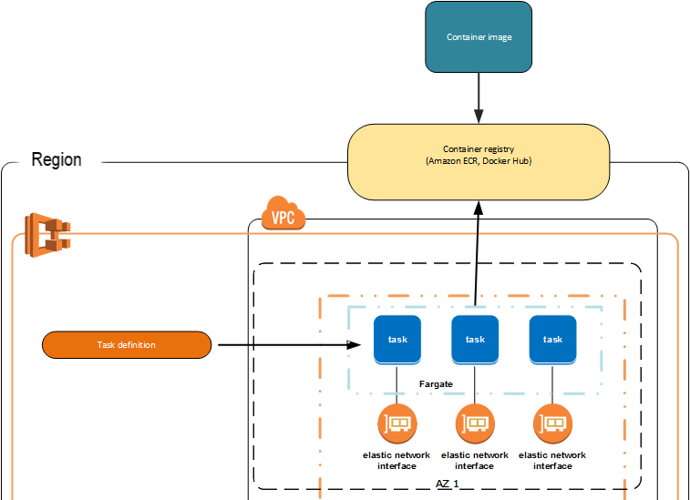
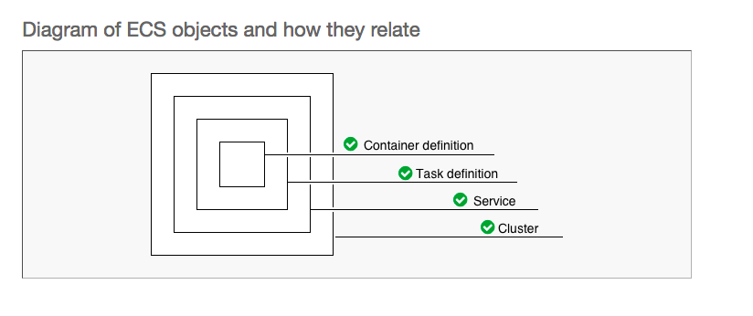
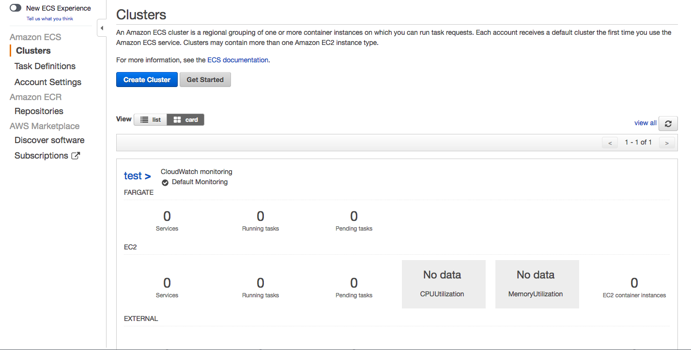

# Amazon Elastic Container Service (Amazon ECS)

---

- Amazon Elastic Container Service (Amazon ECS) es un servicio de control de contenedores totalmente administrado que le ayuda a implementar, administrar y escalar aplicaciones con contenedores.

- Permite ejecutar y mantener un número determinado de tareas simultáneamente en un clúster.

---

---

### Infrastructura
- Opción sin servidor:
    - Las características de Amazon ECS se integran con el motor informático sin servidor de AWS Fargate. 
    - AWS Fargate facilita la tarea de centrarse en la creación de aplicaciones al eliminar la necesidad de aprovisionar y administrar instancias de Amazon EC2. 
- Usando máquinas EC2.

--- 

---

---

---

# DEMO
