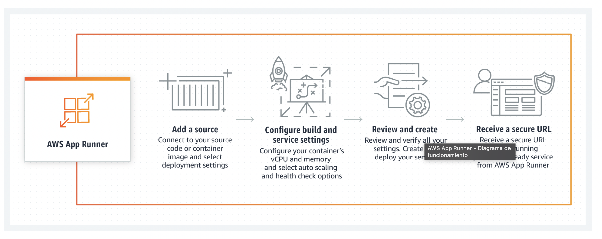

# Amazon App Runner

---

- AWS App Runner es un servicio totalmente administrado que facilita a los desarrolladores la implementación rápida de aplicaciones web y API en contenedores, a escala y sin necesidad de experiencia previa en infraestructura. 
- Puede funcionar con código fuente o una imagen de contenedor. 
- App Runner crea e implementa la aplicación de manera automática, equilibra la carga del tráfico con cifrado, escala para cumplir sus necesidades de tráfico y facilita que sus servicios se comuniquen con otros servicios de AWS y aplicaciones que se ejecutan en una Amazon VPC privada. 

---

---

# DEMO

---

# Ejercicio

- Despliega el API Realizado anteriormente en un contenedor con App Runner.