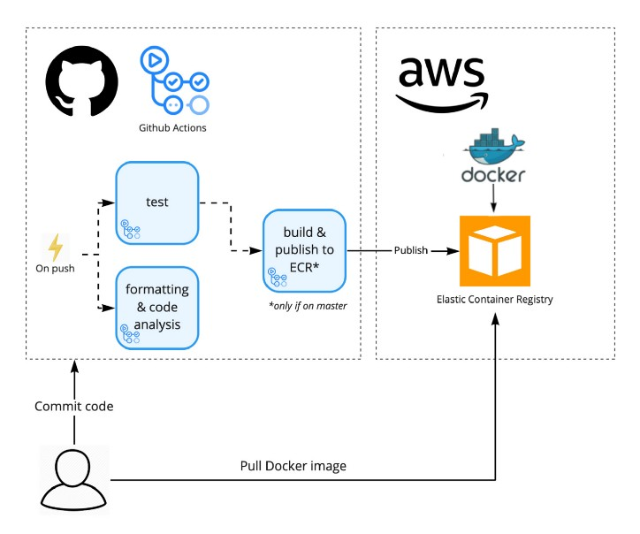

# Despliege automatico de funciones lamnda con Github Actions.

<style>
img[alt~="center"] {
  display: block;
  margin: 0 auto;
}
</style>


---

- Podemos configurar una accion de github para que cuando se realice un commit en la rama que queramos una función lamnda se despliege automaticamente.
- Tienes un ejemplo en https://github.com/fernandodelacalle/test-deploy-lamnda
- El workflow construye la imagen de docker automáticamente y la sube a tu ECR.
- Por ultimo despliega la nueva versión en AWS lamnda.

---



---

- El sigueinte fichero YAML realiza está acción:
```yaml
name: Deploy to Amazon 

on:
  push:
    branches:
    - main

env:
  AWS_REGION: eu-west-3      # set this to your preferred AWS region, e.g. us-west-1
  ECR_REPOSITORY:            # set this to your Amazon ECR repository name

defaults:
  run:
    shell: bash

jobs:
  deploy:
    name: Deploy
    runs-on: ubuntu-latest
    permissions:
      packages: write
      contents: read

    steps:
      - name: Checkout
        uses: actions/checkout@v2

      - name: Configure AWS credentials
        uses: aws-actions/configure-aws-credentials@13d241b293754004c80624b5567555c4a39ffbe3
        with:
          aws-access-key-id: ${{ secrets.AWS_ACCESS_KEY_ID }}
          aws-secret-access-key: ${{ secrets.AWS_SECRET_ACCESS_KEY }}
          aws-region: ${{ env.AWS_REGION }}

      - name: Login to Amazon ECR
        id: login-ecr
        uses: aws-actions/amazon-ecr-login@aaf69d68aa3fb14c1d5a6be9ac61fe15b48453a2

      - name: Build, tag, and push image to Amazon ECR
        id: build-image
        env:
          ECR_REGISTRY: ${{ steps.login-ecr.outputs.registry }}
          IMAGE_TAG: ${{ github.sha }}
        run: |
          # Build a docker container and
          # push it to ECR so that it can
          # be deployed to ECS.
          docker build -t $ECR_REGISTRY/$ECR_REPOSITORY:$IMAGE_TAG .
          docker push $ECR_REGISTRY/$ECR_REPOSITORY:$IMAGE_TAG
          echo "::set-output name=image::$ECR_REGISTRY/$ECR_REPOSITORY:$IMAGE_TAG"
      - name: Deploy function
        env:
          ECR_REGISTRY: ${{ steps.login-ecr.outputs.registry }}
          IMAGE_TAG: ${{ github.sha }}
        run: |
          aws lambda update-function-code --region eu-west-3 --function-name funDocker --image-uri $ECR_REGISTRY/$ECR_REPOSITORY:$IMAGE_TAG
```


---

- Para que funcione necesitamos configurar las variables:
    - AWS_ACCESS_KEY_ID
    - AWS_SECRET_ACCESS_KEY

---

# DEMO

---
# Ejecicico 

- Crea un nuevo repositorio.
- Crea una nueva función lamnda en la consola de AWS.
- Crea un workflow que despliege la función automaticamente cada vez que se realice un push.
