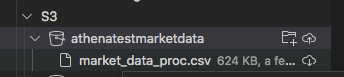
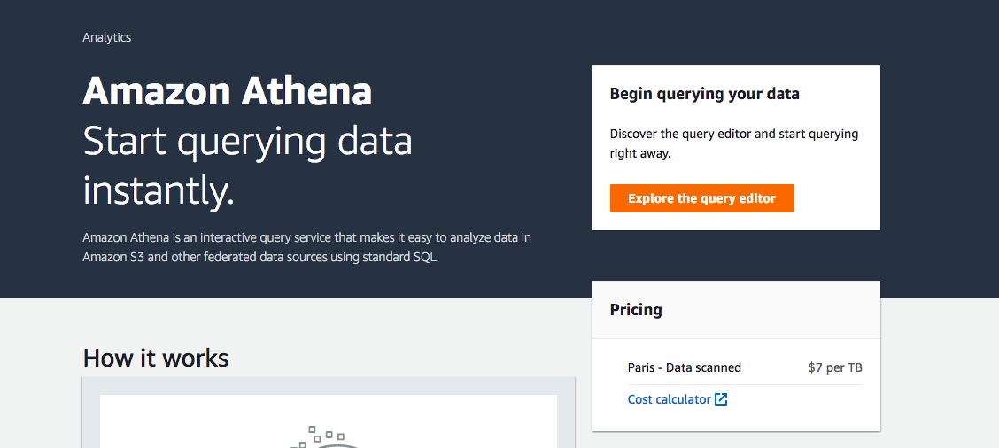
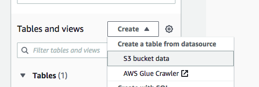
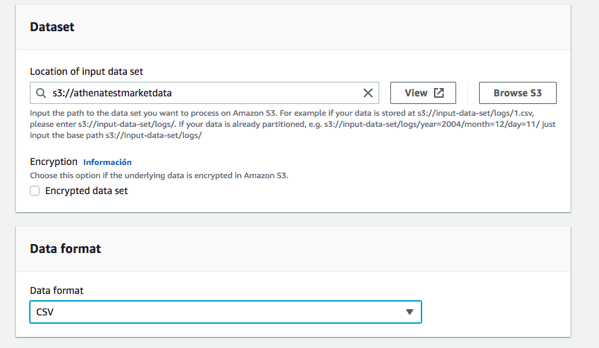
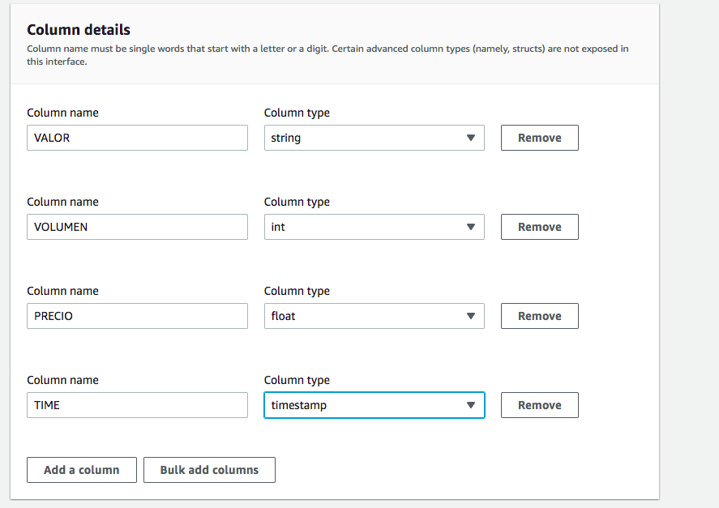
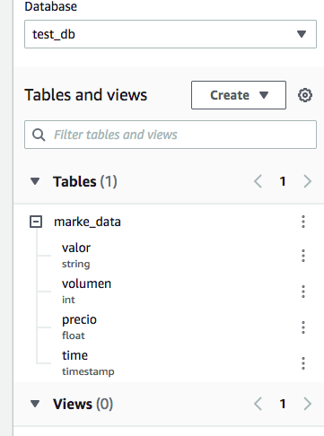
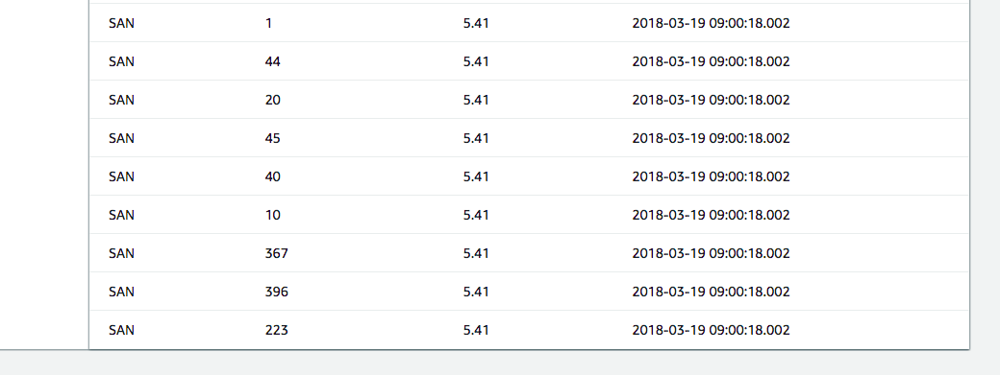

<style>
img[alt~="center"] {
  display: block;
  margin: 0 auto;
}
</style>

# Amazon Athena


---


- Amazon Athena es un servicio de consultas interactivo que facilita el análisis de datos en Amazon S3 con SQL estándar. 
- Athena no tiene servidor, de manera que no es necesario administrar infraestructura y solo paga por las consultas que ejecuta.

---

- Añadimos ficheros csv con el mismo formato a un bucket.


---

- Creamos una tabla en aws athenea:


---


---


---



---



---



---

- Podemos hacer consultas desde python con pyathena.
- Se instala con:
```bash
pip install pyathena
```

---

- Necesitamos un nuevo bucket de staging.
- Podemos hacer una consulta con:

```python
from pyathena import connect
import pandas as pd

conn = connect(s3_staging_dir='s3://atheneastaging', region_name='eu-west-3')
df = pd.read_sql('SELECT * FROM "test_db"."marke_data" limit 100', conn)
print(df)
```
---

# DEMO

