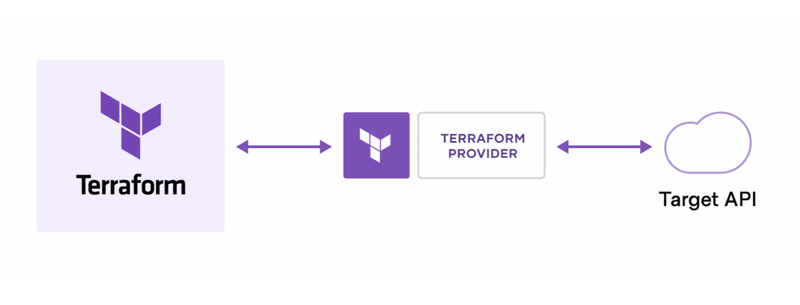

<style>
img[alt~="center"] {
  display: block;
  margin: 0 auto;
}
</style>

# Terraform

---
- Infrastructure as Code (IaC) is the process of managing and provisioning cloud infrastructure with machine-readable definition files.
- Supports multi-cloud & hybrid infrastructure

---

- Terraform is an open source provisioning tool.
- It ships as a single binary which is written in Go. Terraform is cross platform and can run on Linux, Windows, or MacOS.
- Installing terraform is easy. You simply download a zip file, unzip it, and run it.

---



---

Install:
- https://www.terraform.io/downloads

---
# Terraform Command Line
Terraform is a command line tool. Terraform commands are either typed in manually or run automatically from a script.
The commands are the same whether you are on Linux or Windows or MacOS.
Terraform has subcommands that perform different actions.

```bash
# Basic Terraform Commands
terraform version
terraform help
terraform init
terraform plan
terraform apply
terraform destroy
```

---


---

# Terraform Code

Terraform code, or simply terraform is a declarative language that is specifically designed for provisioning infrastructure on any cloud or platform.


---

Terraform files always end in either a *.tf or *.tfvars extension.

Most terraform workspaces contain a minimum of three files:

main.tf - Most of your functional code will go here.
variables.tf - This file is for storing variables.
outputs.tf - Define what is shown at the end of a terraform run.

---

Every terraform resource is structured exactly the same way.

```
resource type "name" {
  parameter = "foo"
  parameter2 = "bar"
  list = ["one", "two", "three"]
}
```

resource = Top level keyword
type = Type of resource. Example: aws_instance.
name = Arbitrary name to refer to this resource. Used internally by terraform. This field cannot be a variable.

---

# Terraform Provider Configuration

The terraform core program requires at least one provider to build anything.

You can manually configure which version(s) of a provider you would like to use. If you leave this option out, Terraform will default to the latest available version of the provider.

```
provider "aws" {
  version = "=2.35.0"
}
```

AWS Provider Documentation: https://registry.terraform.io/providers/hashicorp/aws/latest/docs

---

- Terraform Init: Terraform fetches any required providers and modules and stores them in the .terraform directory. If you add, change or update your modules or providers you will need to run init again.
- Terraform Plan: Preview your changes with terraform plan before you apply them.
- Terraform Apply: terraform apply runs a plan and then if you approve, it applies the changes.
- Terraform Destroy: Terraform destroy does the opposite. If you approve, your infrastructure is destroyed.

---

# DEMO

---

# Ejercicio

- Desliega una función lamnda usando terraform. Usa una imagen de los ejercios anteriores.
