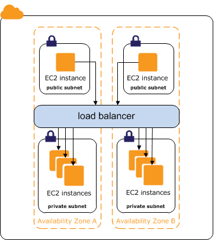

# Amazon Elastic Load Balancing y API Gateway

---

- Elastic Load Balancing distribuye automáticamente el tráfico de aplicaciones entrante a través de varios destinos, tales como las instancias de Amazon EC2, los contenedores, las direcciones IP, las funciones Lambda y los dispositivos virtuales

- Puede controlar la carga variable del tráfico de su aplicación en una única zona o en varias zonas de disponibilidad

---

## Internet-facing Classic Load Balancers

---

## Internal Classic Load Balancers

---

# DEMO

---
## Amazon API Gateway

- Amazon API Gateway es un servicio de AWS para la creación, la publicación, el mantenimiento, el monitoreo y la protección de las API REST.

---

API Gateway crea API RESTful que:
- Se basan en HTTP.
- Habilitan la comunicación entre cliente y servidor sin estado.
- Implementan métodos HTTP estándar como, por ejemplo, GET, POST, PUT, PATCH y DELETE.

---

- Junto con AWS Lambda, API Gateway es la parte de la infraestructura sin servidor de AWS orientada a la aplicación.

- Se puede utilizar Lambda para interactuar con los servicios necesarios y exponer las funciones de Lambda a través de los métodos de API de API Gateway.

